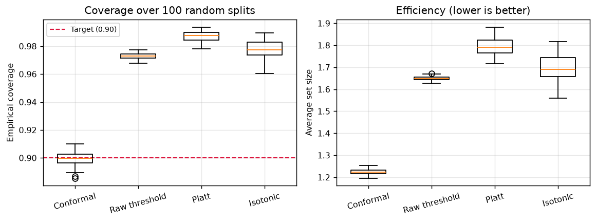
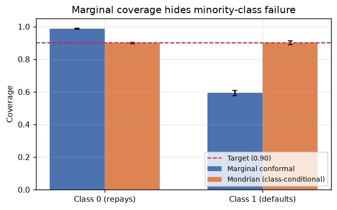
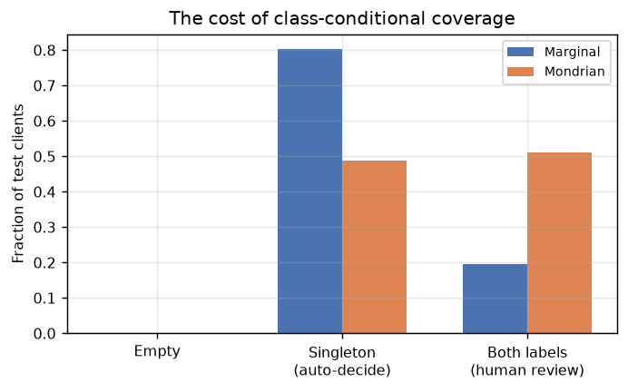

# Distribution-Free Uncertainty Quantification for Credit Risk

Turning an ML classifier's unreliable confidence scores into prediction sets with a
provable error rate — and a principled rule for which cases need human review.

**Headline:** across 100 random splits, split conformal prediction achieved
**89.95% ± 0.46% empirical coverage against a 90% nominal target** (gap: 0.0005),
while standard calibration methods missed by 7–9 percentage points and produced
40% wider prediction sets.

---

## The problem

A credit model outputs `P(default) = 0.83`. Gather every client scored ~0.83 and
check what happened: on this dataset, 74.6% defaulted, not 83%. The score ranks
clients correctly but the number does not correspond to a real-world frequency,
so the model cannot answer "how often are you wrong?"

Conformal prediction changes the output rather than correcting the number. Instead
of a probability, it returns a **set of labels with a provable guarantee**:

| Output | Meaning | Action |
|---|---|---|
| `{repays}` | Confident | Auto-approve |
| `{defaults}` | Confident | Auto-decline |
| `{repays, defaults}` | Cannot separate at 90% confidence | Human review |

The third case is the deliverable: a principled, guaranteed-correct abstention rule.

---

## Results

### 1. Conformal hits the target; calibration methods do not

100 random splits, LightGBM base model, target coverage 90%.

| Method | Coverage | Avg set size | Gap from target | Auto-decided |
|---|---|---|---|---|
| **Split conformal** | **0.8995 ± 0.0046** | **1.224** | **0.0005** | **77.6%** |
| Raw thresholding | 0.9729 ± 0.0021 | 1.649 | 0.0729 | 35.1% |
| Isotonic regression | 0.9777 ± 0.0062 | 1.698 | 0.0777 | 30.2% |
| Platt scaling | 0.9871 ± 0.0035 | 1.794 | 0.0871 | 20.6% |



At the same nominal confidence, conformal decides 77.6% of clients automatically
against Platt's 20.6% — nearly **4× the manual review burden** from a method that
also misses its own target.

**Notably, the base model was already well calibrated (ECE = 0.026).** Good
calibration and coverage control are orthogonal properties; only one comes with a
guarantee.

### 2. Marginal coverage hides a minority-class failure

The 89.95% figure is an average, and 78% of clients repay.

| Method | Overall | Class 0 (repays) | Class 1 (defaults) |
|---|---|---|---|
| Marginal conformal | 0.8995 | 0.9866 | **0.5931** |
| Mondrian (class-conditional) | 0.9001 | 0.8998 | **0.9011** |



A defaulter had a **41% chance of receiving a confidently wrong `{repays}` set** —
the system was most reliable exactly where it mattered least. Computing a separate
threshold per class fixes it.

**The cost is real and reported:** set size rises 1.22 → 1.51, and automatic
decisions fall 77.6% → 48.9%. The marginal method was not cheaper; it was failing
on defaulters and pocketing the savings.



### 3. Validity is a property of the procedure, not the model

24 configurations: 4 base models × 3 score functions × 2 calibration schemes,
30 seeds each.

**Every configuration produced coverage between 0.9003 and 0.9018** — across a
6-point AUC spread (logistic 0.704 → random forest 0.767). Over the same grid,
set size ranged 1.22–1.73 and marginal minority-class coverage ranged 0.56–0.90.

> **Validity is constant. Efficiency is not.** The weakest model paid for its
> weakness in set size, never in broken coverage.

### 4. Shift breaks the guarantee, and the fix has a price

Coverage holds only under exchangeability. Inducing covariate shift by enriching
the test set toward older / lower-limit clients:

| Scenario | Unweighted | Weighted conformal | Seeds improved |
|---|---|---|---|
| Strong shift (credit limit) | 0.8864 | **0.9004** | 10/20 |
| Mild shift (age) | 0.8973 | 0.8985 | **5/20** (t = −3.54) |

Weighted conformal — a learned domain classifier converted into density-ratio
weights — fully recovered the strong shift. It **significantly degraded** the mild
one, because importance weighting collapsed effective calibration sample size to
**8% (630 of 7,873 points)**, tripling variance.

> Weighted conformal is worth applying when shift is large. When shift is mild,
> the variance cost exceeds the bias correction.

Paired testing was essential: unpaired means suggested weighting *helped* the age
scenario, when it hurt on 15 of 20 seeds.

---

## Negative result, reported

A learned difficulty model (normalized conformal) was implemented to make set
sizes adapt per instance. It **produced no improvement** (set size 1.2260 → 1.2202,
within noise).

Diagnosis: the difficulty model was 81% explained by the base model's own output
(R² = 0.809 on `p₁` and uncertainty), with the residual correlating with true
difficulty at only 0.0996. It had learned to re-derive `p(x)` rather than discover
independent signal — and dividing a score by something that tracks the score
itself is nearly a rescaling, which cannot change prediction sets.

> Normalized conformal helps when difficulty varies for reasons the base model
> cannot see. On homogeneous tabular data where the model already uses every
> feature, no residual structure remains.

---

## Method

Split conformal, implemented from scratch (~20 lines of NumPy):

1. Hold out a **calibration set** the model never trained on
2. Score each calibration point: `s = 1 − p̂(true label)`
3. Take `q̂` = the `⌈(n+1)(1−α)⌉`-th smallest score
4. For a new client, keep every label with score ≤ `q̂`

The guarantee follows from a rank argument: the test point's score is one more
draw from the same pool as the calibration scores, so it falls above `q̂` with
probability ≈ α. **No assumption on the model or the data distribution — only
exchangeability.** The `(n+1)` correction accounts for the test point joining the
pool, and is what makes the guarantee finite-sample rather than asymptotic.

---

## Data

[UCI Default of Credit Card Clients](https://archive.ics.uci.edu/dataset/350)
(Taiwan, 2005) — 30,000 clients, 23 features, 22.12% default rate. Downloaded
automatically on first run.

---

## Reproducing

```bash
python -m venv .venv && source .venv/bin/activate   # Windows: .venv\Scripts\activate
pip install numpy pandas scikit-learn lightgbm matplotlib ucimlrepo

python run_day2.py    # headline: conformal vs baselines, 100 seeds
python run_day3.py    # class-conditional failure and Mondrian fix
python run_day4.py    # 24-configuration ablation (~20 min)
python run_day5.py    # learned difficulty model (null result)
python run_day6.py    # distribution shift and weighted conformal
python make_figures.py
```

## Repository layout

| Path | Contents |
|---|---|
| `src/conformal.py` | Split conformal, LAC/APS/RAPS scores, Mondrian, evaluation |
| `src/baselines.py` | Raw thresholding, Platt scaling, isotonic regression |
| `src/difficulty.py` | Out-of-fold scoring, learned difficulty model |
| `src/shift.py` | Shift splits, domain classifier, weighted quantile |
| `src/models.py` | Four base models behind one interface |
| `src/splits.py` | Seeded three-way stratified splitting |
| `src/data.py` | Dataset registry with disk caching |
| `run_day*.py` | Experiments, one per finding |
| `results/`, `figures/` | Saved outputs |

## Limitations

- Single dataset; the model-agnostic claim is demonstrated across models and
  score functions but not across datasets
- Available shifts on this data are mild (0.3–1.4 points of coverage degradation)
- Importance weights clipped at [1/20, 20]; difficulty predictions floored at 0.05
- Binary classification only — APS requires randomization here, since the second
  label's cumulative mass is always exactly 1.0

## References

- Vovk, Gammerman & Shafer (2005), *Algorithmic Learning in a Random World*
- Angelopoulos & Bates (2021), *A Gentle Introduction to Conformal Prediction*
- Romano, Sesia & Candès (2020), *Classification with Valid and Adaptive Coverage* (APS)
- Angelopoulos et al. (2021), *Uncertainty Sets for Image Classifiers using Conformal Prediction* (RAPS)
- Tibshirani, Barber, Candès & Ramdas (2019), *Conformal Prediction Under Covariate Shift*